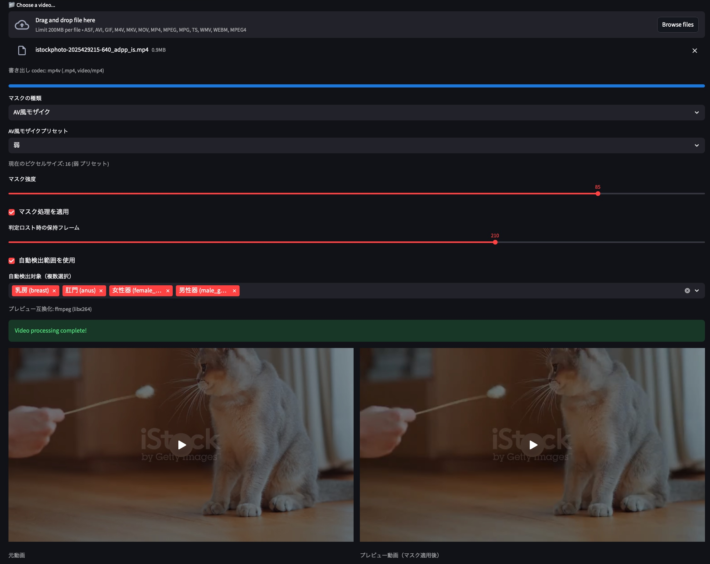

# Docker 起動手順

この手順書では、Docker コンテナを起動し、ブラウザでアプリを開くところまでを順番に説明します。

## アプリ画面

以下はアプリの画面イメージです。



## 1. 事前準備

1. Docker Desktop をインストールします。
	- ダウンロード: https://www.docker.com/products/docker-desktop/
2. Docker Desktop を起動します。
3. VS Code でプロジェクトフォルダを開きます。
4. VS Code で新しいターミナルを開きます (Terminal -> New Terminal)。

確認コマンド:

```powershell
docker --version
docker compose version
```

どちらもバージョンが表示されれば準備完了です。

## 2. Docker ファイルの配置

このプロジェクトでは Docker 関連ファイルを次に配置しています。

- docker/Dockerfile
- docker/Dockerfile.windows
- docker/docker-compose.yml
- docker/docker-compose.windows.yml
- .dockerignore

補足:

- .dockerignore は Docker の仕様上、ビルドコンテキストのルートに必要です。
- この構成ではビルドコンテキストがプロジェクトルートのため、.dockerignore はルート配置です。

## 3. コンテナをビルドして起動

このプロジェクトは 2 通りの起動方法に対応しています。

- Linux コンテナで起動する場合 (既定): docker-compose.yml
- Windows コンテナで起動する場合: docker-compose.windows.yml

### 3-1. Linux コンテナで起動

Windows で Linux コンテナを使う場合は、先に WSL2 を設定します。

1. 管理者権限の PowerShell で WSL を有効化します。

```powershell
wsl --install
```

1.5. Ubuntu の導入は Microsoft Store から行う方法が簡単です。

- Microsoft Store で "Ubuntu" を検索してインストール
- 初回起動時に Linux ユーザー名とパスワードを作成

コマンドで入れる場合は次も利用できます。

```powershell
wsl --install -d Ubuntu
```

2. 再起動後、WSL の既定バージョンを 2 に設定します。

```powershell
wsl --set-default-version 2
```

3. Docker Desktop を開き、次を確認します。

- Settings -> General: Use the WSL 2 based engine を有効化
- Settings -> Resources -> WSL Integration: 使用するディストリビューション (例: Ubuntu) を有効化

4. WSL 側で状態を確認します。

```powershell
wsl -l -v
```

VERSION が 2 で表示されれば設定完了です。

補足:

- パフォーマンスのため、ソースコードは WSL 側ファイルシステム (例: /home/<user>/...) に置くことを推奨します。

VS Code ターミナルで、まず Docker ディレクトリへ移動します。

```powershell
cd docker
```

その後、次を実行します。

```powershell
docker compose up --build -d
```

初回はイメージビルドがあるため数分かかることがあります。

### 3-2. Windows コンテナで起動

1. Docker Desktop で Windows Containers モードに切り替えます。
2. VS Code ターミナルで docker ディレクトリへ移動します。

```powershell
cd docker
```

3. Windows 用 compose ファイルを指定して起動します。

```powershell
docker compose -f docker-compose.windows.yml up --build -d
```

補足:

- Windows コンテナは Linux コンテナよりイメージサイズが大きくなりやすく、初回起動に時間がかかることがあります。

## 4. 起動状態を確認

コンテナ状態を確認します。

```powershell
docker compose ps
```

Windows 用 compose を使って起動した場合は、同じ compose ファイルを指定します。

```powershell
docker compose -f docker-compose.windows.yml ps
```

app サービスが Up になっていれば起動成功です。

必要に応じてログを確認します。

```powershell
docker compose logs -f
```

Windows 用 compose を使って起動した場合:

```powershell
docker compose -f docker-compose.windows.yml logs -f
```

ログの追尾を終了する場合は Ctrl + C を押します。

## 5. ブラウザで開く

1. ブラウザを開きます。
2. 次の URL にアクセスします。

- http://localhost:8501

表示されれば起動完了です。

PowerShell から直接開く場合:

```powershell
start http://localhost:8501
```

## 6. 停止と再起動

停止:

```powershell
docker compose down
```

Windows 用 compose を使って起動した場合:

```powershell
docker compose -f docker-compose.windows.yml down
```

再起動 (ビルドなし):

```powershell
docker compose up -d
```

Windows 用 compose を使って起動した場合:

```powershell
docker compose -f docker-compose.windows.yml up -d
```

依存関係変更後の再起動 (再ビルドあり):

```powershell
docker compose up --build -d
```

Windows 用 compose を使って起動した場合:

```powershell
docker compose -f docker-compose.windows.yml up --build -d
```

## 7. データ永続化

- uploaded_media はホストとコンテナで共有されるため、コンテナ再作成後も保持されます。

## 8. トラブルシュート

### 8-1. 起動しない

```powershell
docker compose logs -f
```

ログにエラー内容が出るので、内容に応じて対処します。

### 8-2. ブラウザで開けない

1. docker compose ps で app が Up か確認
2. URL が http://localhost:8501 になっているか確認
3. セキュリティソフトやローカルファイアウォールを確認

### 8-3. モデル読み込みエラー

次のファイルが存在することを確認します。

- models/classification_model.pt
- models/segmentation_model.pt

### 8-4. ffmpeg 関連エラー

キャッシュなしで再ビルドします。

```powershell
docker compose build --no-cache
docker compose up -d
```
